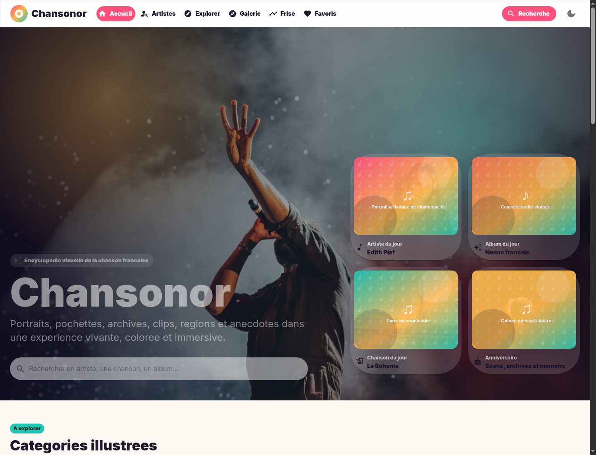
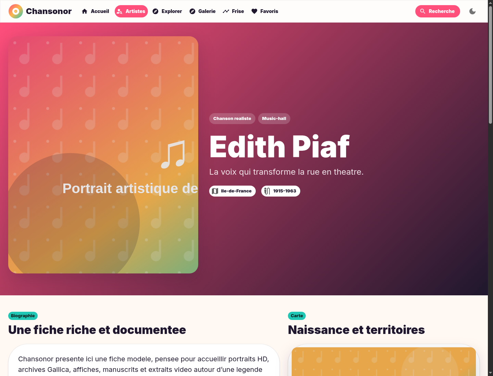
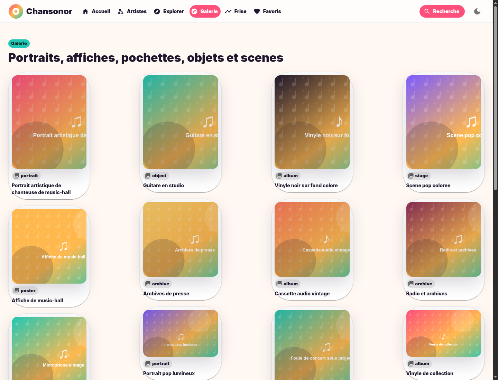
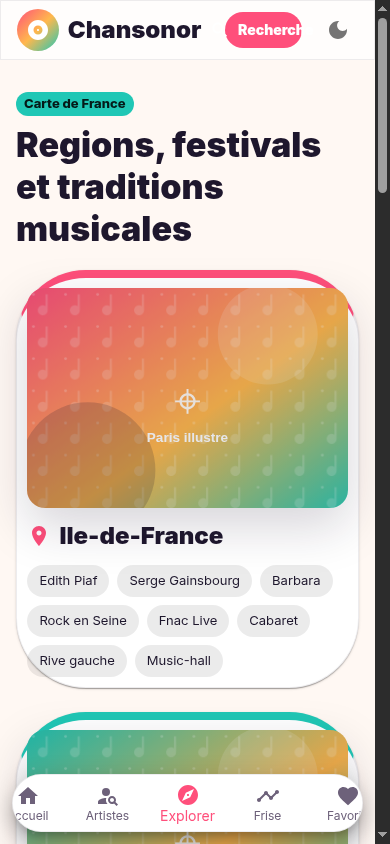

# Chansonor


**Chansonor** est une PWA React consacree a la chanson francaise. L’objectif est de proposer une encyclopedie interactive, visuelle et immersive, proche d’un magazine musical moderne ou d’une exposition numerique.

L’application met l’image au centre de l’experience : portraits, pochettes, affiches, archives, cartes, objets, scenes et placeholders illustres sont prevus pour eviter tout ecran vide.

## Etat actuel

- Dernier pack de contenu traite : Pack long terme 027.
- Prochaine session de contenu : Pack long terme 028, avec objectif de poursuivre vers 500 artistes majeurs.
- Contenus indexes : 440 artistes, 466 chansons, 260 albums.
- Portraits reels : environ 293 portraits Wikimedia/Wikidata trouves sur 440 artistes, avec fallback visuel pour les fiches restantes.
- Deploiement Netlify : les routes React profondes sont prises en charge via `public/_redirects`.
- Etat de fin de session du 2026-07-19 : tous les packs locaux 020 a 027 sont commites, validations OK, push demande.

## Captures d’ecran

### Accueil immersif



### Fiche artiste



### Galerie



### Responsive mobile



## Fonctionnalites

- Hero visuel avec artiste, album, chanson, anniversaire et recherche.
- Sections illustrees : artistes, albums, chansons, collections, decennies et timeline.
- Fiches artistes riches : portrait HD, galerie, bio, discographie, chansons, carte, collaborations, influences et recompenses.
- Galerie type moodboard avec portraits, pochettes, affiches, objets et archives.
- Exploration par regions et styles musicaux.
- Recherche instantanee avec miniatures, types, styles et annees.
- Quiz graphique avec feedback anime.
- Favoris sauvegardes localement avec IndexedDB.
- Mode clair / sombre.
- PWA avec manifest, icone d’application et service worker.
- Lazy loading des images, `srcSet` responsive et fallback SVG automatique.
- Portraits artistes reels charges depuis Wikimedia/Wikidata avec cache navigateur et fallback local.

## Stack

- React
- TypeScript
- Vite
- Material UI
- Framer Motion
- React Router
- IndexedDB via `idb`
- Service Worker
- Vitest + Testing Library

## Sources media prevues

Le modele de donnees `VisualAsset` prepare l’integration de grands fonds visuels :

- Wikimedia Commons
- Gallica / BnF
- Europeana
- Internet Archive
- Openverse
- MusicBrainz
- Discogs
- Last.fm
- TMDB
- YouTube thumbnails
- Unsplash
- Pixabay
- Pexels

Chaque media peut porter une source, un credit, une couleur dominante, un type et un texte alternatif.

## Installation

```bash
npm install
```

## Developpement

```bash
npm run dev
```

L’application est ensuite disponible par defaut sur :

```text
http://localhost:5173/
```

## Validation

```bash
npm run build
npm test
npm audit
```

Etat actuel :

- Build production : OK
- Tests : OK
- Audit npm : 0 vulnerabilite

## Architecture

```text
src/
  components/   Composants UI reutilisables
  data/         Donnees editoriales et references media
  pages/        Ecrans routes
  services/     Persistance locale et portraits Wikimedia
  styles/       Styles globaux
  types/        Types TypeScript du domaine
public/
  icons/        Icone PWA
  sw.js         Service worker
  _redirects    Fallback Netlify vers index.html pour les routes React
docs/
  screenshots/ Captures README
```

## Icône

L’icône de l’application est disponible ici :


Elle est declaree dans `public/manifest.webmanifest` pour l’installation PWA Android.
